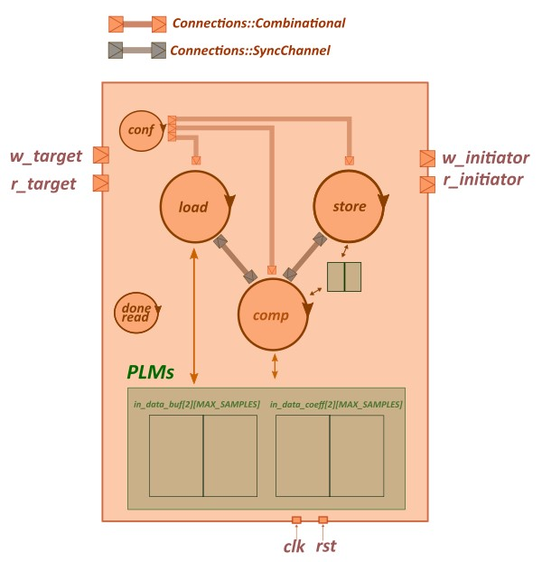
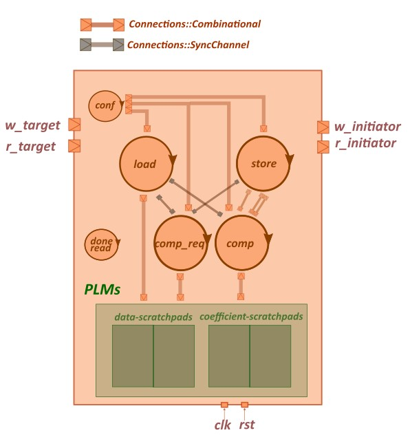

###  mac_axi ###

<p align='center'>



The MAC is described in SystemC using five SC_THREADs:

Two threads for configuration and interrupt:
- `config`
- `done_read`

Three standards threads of the accelerator structure:
- `load_input`
- `compute_kernel`
- `store_output`

The threads are synchronized using Connections::SyncChannel and Connections::Combinational channels. Thanks to ping-pong buffering, threads operate in pipeline, so that input and output phases partially overlap with computation. However, notice that this example does not provide a synthesizable implementation for the private local memory (PLM) implementation and access methods.

The interface with the testbench consists of a target AXI interface (`w_slave` and `r_slave`) and an initiator AXI interface (`w_master` and `r_master`). The functionality of the interface is implemented by leveraging the AXI4-segment IP provided by Matchlib.

The testbench is modeling a processor running software that preprocesses some data in memory and then configures the accelerator's registers via AXI. After configuration, the testbench waits for the interrupt before dumping the content of the memory and validating the accelerator's result.

Communication between the accelerator and memory is handled via direct memory access (DMA), also modeled by a testbench module that offers an AXI target interface. The behavior of the memory controller is modeled by leveraging the AXI burst transactions supported by the Matchlib library.

To run a behavioral simulation of the SystemC implementation of the MAC, launch the following target from the `/sim` subfolder:

```
$ make run
```

###  mac_hls ###

<p align='center'>




The synthesizable MAC is described in SystemC using six SC_THREADs:

Two threads for configuration and interrupt:
- `config`
- `done_read`

Three standards threads of the accelerator structure:
- `load_input`
- `compute_kernel`
- `store_output`

An additional thread to send read requests to the scratchpads for the computatiion:
- `compute_kernel_req`

The local memory of the accelerator is organized as follows:
- Two scratchpads are used to implement a ping-pong buffer for the MAC input coefficients.
- Two scratchpads are used to implement a ping-pong buffer for the MAC input data.

For each scratchpad, we instantiate three combinational channels (not all of them showed in the picture for practical reasons) to access them:
- write request channel
- read request channel
- read response channel

Since `NVECTORS=1` (just a single couple of data-coefficient vectors to multiply and accumulate for each iteration), no output scratchpad is needed. The accumulated value is transferred from the `compute_kernel` to the `store_kernel` using shared registers implemented with `Combinational::Connections`.

Threads synchronization, testbench modeling and DUT-testbench communcation replicates the `mac_axi` design.

With respect to `mac_axi`, the design includes the additional synthesizable logic in the `#ifdef HLS_READY` branches and the old logic in the `#else` branches.

Refer to the following targets to launch from the `/syn` subfolder:

```
# Run behavioral SystemC simulation of non-synthesizable version
$ make run

# Run behavioral SystemC simulation of synthesizable version
$ make run_syn

# Synthesize the synthesizable version using Catapult-HLS (shell option)
$ make hls

# Synthesize the synthesizable version using Catapult-HLS GUI
$ make hls-gui

#Simulate the synthesized design using Modelsim (shell-option)
$ make sim

#Simulate the synthesized design using Modelsim GUI
$ make sim-gui

```

###  mac_hls1 ###

<p align='center'>


The synthesizable MAC is described in SystemC using seven SC_THREADs:

Two threads for configuration and interrupt:
- `config`
- `done_read`

Three standards threads of the accelerator structure:
- `load_input`
- `compute_kernel`
- `store_output`

An additional thread to send read requests to the input data and coefficients scratchpads for the computatiion:
- `compute_kernel_req`

An additional thread to send read requests to the output accumulation scratchpads for storing data back to main memory:
- `store_output_req`

The local memory of the accelerator is organized as follows:
- Two scratchpads are used to implement a ping-pong buffer for the MAC input coefficients.
- Two scratchpads are used to implement a ping-pong buffer for the MAC input data.
- Two scratchpads are used to implement a ping-pong  accumulation for the MAC results.

For each scratchpad, we instantiate three combinational channels (not all of them showed in the picture for practical reasons) to access them:
- write request channel
- read request channel
- read response channel

Testbench modeling and DUT-testbench communcation replicates the `mac_axi` design. Threads synchronization is based on `Connections::SyncChannel` as in the other examples. However, more channels are required as a consequence of the higher number of threads in the design.

With respect to `mac_axi`, the design includes the additional synthesizable logic in the `#ifdef HLS_READY` branches and the old logic in the `#else` branches.

Refer to the following targets to launch from the `/syn` subfolder:

```
# Run behavioral SystemC simulation of non-synthesizable version
$ make run

# Run behavioral SystemC simulation of synthesizable version
$ make run_syn

# Synthesize the synthesizable version using Catapult-HLS (shell option)
$ make hls

# Synthesize the synthesizable version using Catapult-HLS GUI
$ make hls-gui

#Simulate the synthesized design using Modelsim (shell-option)
$ make sim

#Simulate the synthesized design using Modelsim GUI
$ make sim-gui

```
